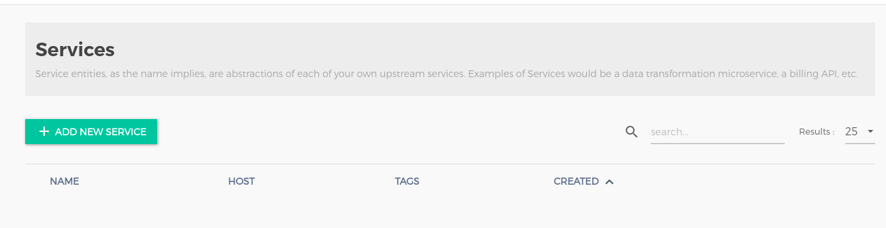
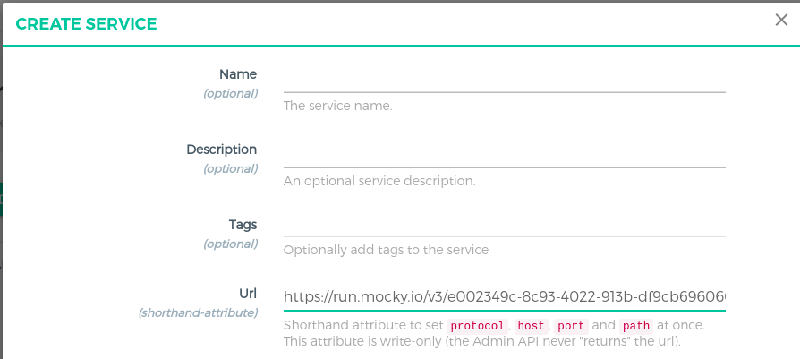
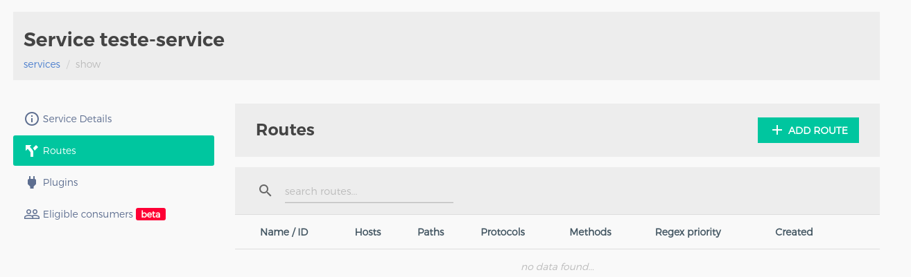
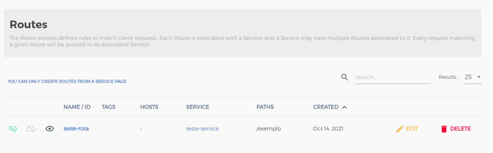

## Artigo kong Api-gateway

### KONGA

**Primeira tela colocar:  **
      usuario: admin  
      password: adminadmin  
      e-mail: < email > .

**Criar conexao**  
      name: kong  
      Kong Admin URL: http://kong:8001

**Telas Konga**  

**Resposta do backend.**  
 curl -v http://localhost:8000/exemplo  
"user":{"email":"test@test.com","password":"Test@13"}}
